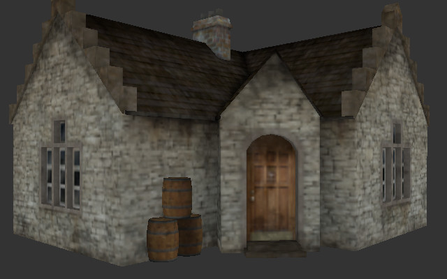
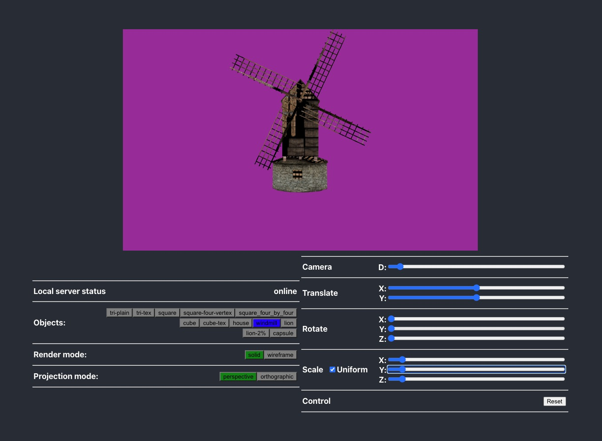

# Assignment 4 - Render a Textured .obj model
In this assigment we will be displaying 
### A house

### A windmill
In this image you see the testharness that you will be working in.  This is provided for you.   You will be enhancing the parsing of your .obj file to store the texture values, and you will be packing the VBO with the minimal vertex data needed to render these images.



> A texture is worth at least a thousand words!
> 
> (See a house to the right that represents a correct output for this assignment)
  
# Resources to help

Some additional resources to help you through this lab assignment


- Assignment Related
	- http://paulbourke.net/dataformats/obj/minobj.html 
		- (I recommend reading this one first for a minimal texture example)
	- Links on the OBJ Model Format (From last assignment)
		- https://people.cs.clemson.edu/~dhouse/courses/405/docs/brief-obj-file-format.html 
			- (I recommend reading this one for more information)
		- https://www.cs.cmu.edu/~mbz/personal/graphics/obj.html
		- https://en.wikipedia.org/wiki/Wavefront_.obj_file

# Description

Previously we have drawn a solid filled color and a wireframe for a .obj model. We were able to parse the .obj file format, picking out the vertices, and then make triangles based on selecting them from an index buffer. One optimization we made use of was OpenGl's [index buffer ](http://www.opengl-tutorial.org/intermediate-tutorials/tutorial-9-vbo-indexing/) which allowed us to *pick* the vertex data that we need to make a triangle. A final call to [glDrawElements](http://docs.gl/gl3/glDrawElements) was finally used to render the model to the screen for the amount of indices we had (which was some multiple of 3). 

For this assignment we are going to add more detail to our loader by adding the ability to texture our model using an image. In our scene, we will also add a perspective camera transformation so we can more properly convey depth in our 3D graphics scene. By the end of this assignment you will have made use of what you learned in previous assignments: The PPM Loader for loading a texture file and the infrastructure for your obj loader. 

### Assignment Strategy

This assignment requires some amount of thinking. The actual amount of lines of code is potentially small (ballpark of 100 or less) if you are building this assignment from our previous lab and object loader. 

Here are my recommendations if you are unsure of where to start:

1.I have provided a starter code that will load the files from the server, and i have provided my implementation of PPM file loading.
	- That is, the vertex layout will take in positions, normals, and texture coordinates.
	- Consider adding to the labs 'Object.hpp' class the functionality to load .obj models **or** to your previous assignment the ability to load in texture data. 


## Task 1 - Rendering a Textured Model (.obj and Texture Coordinates)


For this assignment you are going to render a single textured 3D model. Several are provided in the [objects](./../../common/objects) folder. I have personally tested with the 'house' model for most of my iterations, so I recommend you do the same.

The tasks for rendering in this assignment are the following:
1. Make sure you can parse the .obj file format and associated material file. 
	- read in the vertex (v), vertex texture (vt) and face(f) information.
2. The .obj file should be read in from the command line arguments
	- e.g. `./lab "./../../common/objects/capsule/capsule.obj"`

### OBJ Format -- continued


The models that you will be loading are in the .obj format. This format stores the vertices, texture coordinates, normals, and faces of an object (and potentially other information as well). One way to become familiar with the OBJ file format is to investigate a simple model by opening it in a text editor. Below is a capsule in the .obj file format that was exported from the free tool [Blender3D](https://www.blender.org/). It may also be worth exploring models in 3D modeling and animation tools like Blender3D as well.

### Parsing Texture Coordinates and the Material Files(.mtl)

For this assignment, now we will also make use of the .mtl file that is also generated with .obj files. Let's first take a look at one of the provided .obj files "windmill"

### Windmill .obj

What you will notice below, is that the file looks largely the same. However, there are a few new changes we want to pay attention to.

1. There is something called a **mtllib** that specifies which file to use to find material information.
	- In our case, it is in a file called windmill.mtl that will be described in the next section.
2. There are individual **vt** listings for vertex coordinates that follow the long list of (**v**) vertex listings.
3. Within the face data (lines starting with **f**), there is now vertex texture coordinates for each face.
	- i.e. A face needs a vertex, vertex texture, and vertex normal index.
	- (We are still ignoring normals at this point, though it may be of value to store them)
	- Note that the order they are listed in the file, v's followed by vt's followed by vn's means a face is a series of f v/vt/vn v/vt/vn v/vt/vn, etc.
	
```
# Blender v2.79 (sub 0) OBJ File: ''
# www.blender.org
mtllib windmill.mtl
o WindMill
v -0.553154 1.064796 -0.746740
v -0.553154 1.064796 0.653572
v -0.555058 2.789091 0.648866
v -0.555058 2.789091 -0.742033
# More vertices ..
vt 0.579430 0.005116
vt 0.786357 0.005169
vt 0.785661 0.284613
vt 0.579768 0.284582
vt 0.100437 0.383934
vt 0.009483 0.283401
# ... more data continued
f 1/1/1 2/2/1 3/3/1
f 4/4/2 5/5/2 6/6/2
f 7/7/3 8/8/3 6/6/3
f 9/9/4 10/10/4 11/11/4
f 12/12/5 13/13/5 14/14/5
# ... yet more data continued
```

### Windmill Material File

```
# Blender MTL File: 'None'
# Material Count: 1

newmtl blinn1SG
Ns 0.000000
Ka 0.100000 0.100000 0.100000
Kd 0.000000 0.000000 0.000000
Ks 0.000000 0.000000 0.000000
Ke 0.000000 0.000000 0.000000
Ni 1.500000
d 1.000000
illum 2
map_Kd windmill_diffuse.ppm
map_Bump windmill_normal.ppm
map_Ks windmill_spec.ppm
```

The windmill material(.mtl) file contains some additional data. The first line specifies what the material name is ("blinn1SG"). This is the line that will be referred to within the .obj file. The most important piece of information otherwise is the 'map_Kd' which says where the 'diffuse color' map file is. This is the image where we sample colors from and apply them to triangles.

**Note:** You may assume every .obj model only has one texture per model for this assignment (In games however, it is not uncommon to have a completely separate texture for the characters face for example, so that the body can be the same, but a different 'face' can signify a different character). 

A few of the additional fields are specified in [Paul Burke's guide](http://paulbourke.net/dataformats/obj/minobj.html) {[archived link](./archive/burke.pdf)}, which are primarily used for rendering a scene. For now, we are only interested in the diffuse color map.

### Something fishy about our index buffer strategy

`f 5/5/2 3/6/2 6/7/2`

Taking a closer look at one of the lines, I notice that all of the numbers are not the same. `3/6/2` for instance, is not nicely packed together with the same vertex, vertex texture, and vertex normal. So how does this work with our previous index buffer strategy?

http://www.opengl-tutorial.org/intermediate-tutorials/tutorial-9-vbo-indexing/ provides a nice little algorithm I have referenced below: 

> For each input vertex
>
> &nbsp;&nbsp;Try to find a similar ( = same for all attributes ) vertex between all those we already output
>
> &nbsp;&nbsp;&nbsp;&nbsp;If found :
>
> &nbsp;&nbsp;&nbsp;&nbsp;&nbsp;&nbsp;&nbsp;&nbsp; A similar vertex is already in the VBO, use it instead !
>
> &nbsp;&nbsp;&nbsp;&nbsp;If not found :
>
> &nbsp;&nbsp;&nbsp;&nbsp;&nbsp;&nbsp;&nbsp;&nbsp;No similar vertex found, add it to the VBO

I will provide my explanation of the algorithm, but you will need to think about why this makes sense.

1. Let us take these values `5/5/2`, `3/6/2`, and `6/7/2`
	- The first one `5/5/2` needs the 5th vertex (remember the format v/vt/vn). That means lookup in some data structure, our fifth vertex (a set of x,y,z).
	- We then repeat this process and pick up the fifth texture data, a pair of (s,t) values.
	- ( For this assignment, you can ignore the vertex normal, but I recommend just doing things properly and using it as you'll need it for the next assignment)
2. We can then think of the tuple(5,5,2) as x5,y5,z5,s5,t5. It is a set of unique values, and they may be repeated.
3. This would be different than the tuple (5,6,2) for instance, which is the five floating point numbers numbers x5,y5,z5,s6,t6.
4. So in my vertex buffer data between (5,5,2) and (5,6,2) I have the following data all packed together:
	- x5,y5,z5,s5,t5,x5,y5,z5,s6,t6
	- My 0th index in my index buffer would pull out the values: x5,y5,z5,s5,t5
	- My 1st index in my index buffer would pull out the values: x5,y5,z5,s6,t6
5. Reason about this and think before jumping straight into code.
6. Also understand you can print out the values and compare them with what you see in the actual .obj file (open up the .obj in a text editor).
	- Also, as demonstrated in the first portion of this readme, defining a custom vertexData struct and overloading the operator== can be useful for testing for equality when determining whether or not you need to create a new index, or can otherwise reuse one.

### ModelGL.test.ts
I have provided the unit tests that i used to write my code.   YOu can use these unit tests to guide your development or you can write your own should you want.  

### Loading your own models for this assignment

It is totally fine to provide your own school appropriate Textured 3D .obj files for this assignment. Some notes that may save you time debugging:

- Make sure you push the model, texture(s), and material file to the repository.
- If you use blender3D to export your own .obj model, make sure to scale it to about the size of a unit cube in Blender3D. This will save you time from moving the camera around a lot.
- Triangulate the faces within the blender3D (there is an option when you export)
- Check your material file to make sure it is loading .ppm images which we know how to handle. Use a program like [GIMP](https://www.gimp.org/) to convert them to ASCII format .ppm images otherwise.
- The .ppm image may be 'mirrored', meaning you have to flip it horizontally for the actual texture coordinates to line up with the appropriate vertices.

### Task 3 - Interactive Graphics

CanvasGL.tsx will be provided with a parameter to choose perpective or orthographic projection.  Make sure your code handles this.

A resource for performing keyboard input with SDL is provided here: http://lazyfoo.net/tutorials/SDL/04_key_presses/index.php

### Task 4 - Perspective Camera

Make sure your scene is being rendered in perspective. Make modifications to the vert.glsl as needed. This should be similar to what you have done in a previous lab.

### More Assignment strategy 

My suggested strategy for this project is:

* You can use any of the code from the labs or previous assignments that you may find useful.
	* In fact, I highly recommend it!
* Have a special C++ class(in a .hpp and .cpp file) for loading OBJ models--not doing so is bad style!
	* Utilize any data structure you like in the STL (e.g. std::vector or std::map)
  	* You may assume all faces are triangles (though if you download any test .obj files from the web that may not be the case)
* **Use the textured cube** in ./common/objects/textured_cube/cube.obj to test.
* Think about how you can load a line of text and then split it into individual tokens.
  	* A resource loading files (Filo I/O) in C++ can be found here: http://www.cplusplus.com/doc/tutorial/files/
  	* The reference on strings may be useful: http://www.cplusplus.com/reference/string/string/
    		* Some ideas on string splitting: http://www.martinbroadhurst.com/how-to-split-a-string-in-c.html
* You do not need to use any complex shaders. In fact, I recommend using the most basic ones for this assignment.
* I recommend using this webpage for help with OpenGL: http://docs.gl/gl3/glPolygonMode

## How to run your program

 I will not be running your unit tests in the evalulation of this assignment.  I will be downloading your code with a git pull of your repo then i will do
```
cd <into your directory>
npm install
```
Then i will start visual studio code and will use the menu in the upper right to run the code.   

You can test your code by pulling your repo into a new directory and then trying to run your code as instructed above.  Please make sure that i can run the program in this way.  

# Submission/Deliverables

### Submission

- Commit all of your files to github, including any additional files you create.
- Do not commit any binary files unless told to do so.
- Do not commit any 'data' files generated when executing a binary.

### Deliverables

- You should be able to display a triangulated .obj 3D textured model (several are provided).
- The objects should be able to be spun using the sliders,  the camera distance should work and the scale values should also work.
	

* You need to commit your code to this repository.
* You need to use the build.py script provided. Anything else used is at your own risk--and you should provide complete documentation. If your program does not compile and run, you get a zero!


# F.A.Q. (Instructor Anticipated Questions)

* Q: Why the obj format?
  * A: It is a standard data format understood by most programs.
* Q: Can I load my own models that I have made to show off?
  * A: Sure -- just make sure they are added to the repository (Including the texture)
* Q: Why are my texture coordinates messed up? The geometry looks right?
  * A: Try a different model first to confirm. Then you may have to flip the texture in a modeling program or within your .ppm loader depending on how the coordinates were assigned. 
* Q: What other common errors/debugging can I do?
	1. Use your chrome debugger to step through your loading code when you are running in the interactive mode.
	2. 

* Q: My geometry looks like it is off by 1
	* A: The purpose of the assignment is to be able to parse unique collections of x,y,z and s,t (and the normals) of data. You are essentially building the 'vbo' object, and then indexing into your own collection of xyzst data.
* Q: My object is inside out?
	* A: Did you enable the z-buffer? (`gl.Enable(GL_DEPTH_TEST);`)
  
# Found a bug?

If you found a mistake (big or small, including spelling mistakes) in this lab, kindly send me an e-mail. It is not seen as nitpicky, but appreciated! (Or rather, future generations of students will appreciate it!)

- Fun fact: The famous computer scientist Donald Knuth would pay folks one $2.56 for errors in his published works. [[source](https://en.wikipedia.org/wiki/Knuth_reward_check)]
- Unfortunately, there is no monetary reward in this course :)
