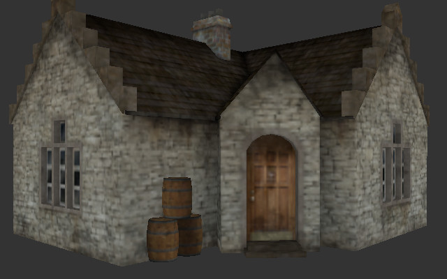
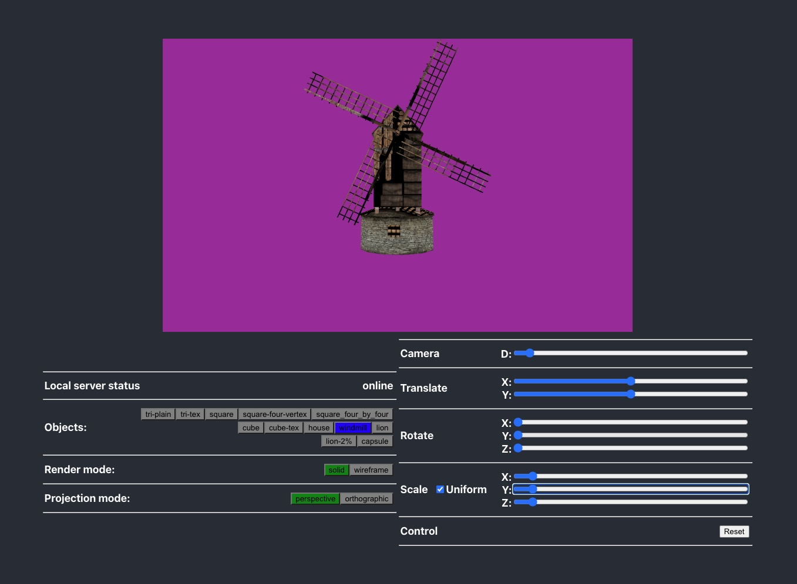

# Assignment 4 - Camera and Textures
In this assigment we will be displaying 
### A house

### A windmill
In this image you see the testharness that you will be working in.  This is provided for you.   You will be enhancing the parsing of your .obj file to store the texture values, and you will be packing the VBO with the minimal vertex data needed to render these images.



> A texture is worth at least a thousand words!
> 
> (See a house to the right that represents a correct output for this assignment)
  
# Resources to help


## Task 1 - Rendering a Textured Model (.obj and Texture Coordinates)


We walked through the set up for getting textures into the GL machine.  In this assignment you will probably use the slides in the texturevideo to update glCanvas.ts, type in the code one line at a time making sure you understand what is going on.  I have removed the texture set up code from the function setUpTexture.  your job is to reimplement this.


### Loading your own models for this assignment


### Task 2 - Camera

Implement Pan left right and pan up and down.
- when you pan you move your eye and lookat point in the same direction by the same amount.
- you will want to figure out what vector to compute for left/right and up/down then add that vector to both your eye and lookAt point.

### Task 3 - Light (directional at 0,1,0
In the next assigment we will deal with a more complex lighting model.   In this assignment you will implement lambertian shading in the ```const fragmentTextureNormalShader =``` Shader

as you can see here
```glsl
/**
 * A shader that uses a texture
 * It also uses a normal map
 * 
 *  */
const fragmentTextureNormalShader =
    `#version 300 es
    precision highp float;
    in vec2 textureCoordOut;
    in vec3 normalOut;
    uniform sampler2D textureSampler;

    out vec4 color;

    void main() {
        vec3 normal = normalize(normalOut);
        vec3 lightDirection = normalize(vec3(0,1, 0));
        vec4 lightColor = vec4(1.0, 0.0, 1.0, 1.0);
        float ambientIntensity = 0.0;
        float lightIntensity = dot(normal, lightDirection);
        // clamp the light intensity to between 0 and 1
        // scale the light intensity to ambientIntensity and 1.0
        // multiply the color by the light intensity (after you get the texture value)
        
        lightIntensity = clamp(lightIntensity, 0.0, 1.0);
        vec2 textureCoord = vec2(textureCoordOut.x, 1.0 - textureCoordOut.y);
        vec4 textureColor = texture(textureSampler, textureCoord);
        
        color = vec4(textureColor.rgb, 1.0);

       
    }
    `;
```

The code is calculating a light intensity value.  your job is to modify the output color so that there is shading.  

Hint:  you might want to multiply the color by the light intensity and normalize it. Follow the comments in the code.

Your solution when the light is at [0,1,0] should look like this for the capsule


## How to run your program

 I will not be running your unit tests in the evalulation of this assignment.  I will be downloading your code with a git pull of your repo then i will do
```
cd <into your directory>
npm install
```
Then i will start visual studio code and will use the menu in the upper right to run the code.   

You can test your code by pulling your repo into a new directory and then trying to run your code as instructed above.  Please make sure that i can run the program in this way.  

# Submission/Deliverables

GitHub submit to your github repository

### Submission

- Commit all of your files to github, including any additional files you create.
- Do not commit any binary files unless told to do so.
- Do not commit any 'data' files generated when executing a binary.

### Deliverables

- The textured objects should appear textured.
- your pan functionality should work
- Lambert Ligthing should work
	

* You need to commit your code to this repository.
* 


# F.A.Q. (Instructor Anticipated Questions)

* Q: Why the obj format?
  * A: It is a standard data format understood by most programs.
* Q: Can I load my own models that I have made to show off?
  * A: Sure -- just make sure they are added to the repository (Including the texture)
  * add them to your repository and then ask for a push. then modify the model loader.

* Q: What other common errors/debugging can I do?
	1. Use your chrome debugger to step through your loading code when you are running in the interactive mode.


# Found a bug?

If you found a mistake (big or small, including spelling mistakes) in this lab, kindly send me an e-mail. It is not seen as nitpicky, but appreciated! (Or rather, future generations of students will appreciate it!)

- Fun fact: The famous computer scientist Donald Knuth would pay folks one $2.56 for errors in his published works. [[source](https://en.wikipedia.org/wiki/Knuth_reward_check)]
- Unfortunately, there is no monetary reward in this course :)
