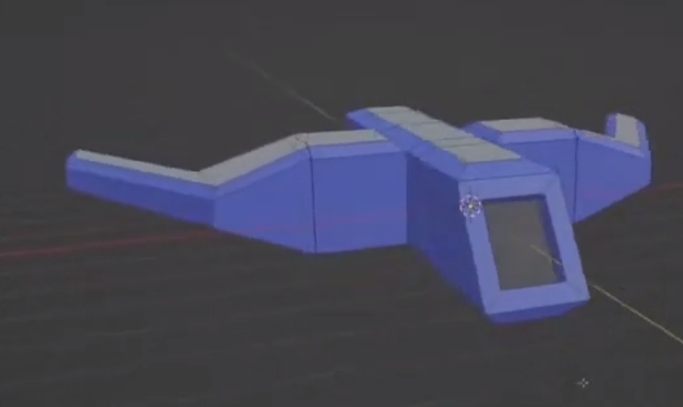

# Part 2 - 3D Object

> 3D Modeling--you are an artist!

# Logistics

You will be creating a 3D model in a 3D application of your choice. I would recommend the free tool [Blender3D](https://www.blender.org/) for this portion of the assignment, and I will provide some helpful tutorials for Blender3D. If you have experience using other 3D tools, then feel free to use those as well.

# Resources to help

Some additional resources to help you through this lab assignment

- Blender3D
	- Here are my very introductory video to 3D Modeling in Blender3D (Pick one):
	 	- [Blender3D Tutorials](https://www.youtube.com/playlist?list=PLvv0ScY6vfd_6J00DzLqlUFs9sa9ImZG5)
	- I found this video very helpful for learning shortcuts.
		- https://www.youtube.com/watch?v=1jHUY3qoBu8
	- Blender 2.8 Beginner 3D Modeling Tutorial
		- https://www.youtube.com/watch?v=elUJCEC06r8 (Make a hammer)
	- MODELING For Absolute Beginners - Blender Tutorial
		- https://www.youtube.com/watch?v=ICBP-7x7Chc (Treasure Chest)
- Note:
	- Most professional modeling software like Maya 3D has academic licenses that are free with a .edu e-mail.

# Description

3D Modeling is a good skill to have. It's not essential to be an expert graphics programmer, but it can be useful when working with artists and communicating as content is made in the Digital Content pipeline.

Check out the resources above for learning how to get started in Blender3D. I recommend my tutorials or otherwise this longer lesson here: https://www.youtube.com/watch?v=1jHUY3qoBu8

## Task 1 - 3D Modeling

Your goal for this task is to create a new 3D object and commit that object to the [./../../common/objects](./../../common/objects) directory of your monorepo. Use this as an opportunity to be creative, and to learn just a little bit about 3D modeling. You don't have to do any texturing or animation, and only need to explore further topics if you like.

That said, you should be creative, and you must model something that is more than a primitive shape (sphere, cube, torus, cylinder, plane).

Your goal will be to download a free 3D modeling program [Blender3D](https://www.blender.org/)  (or otherwise use a 3D tool if you are familiar with another tool), and export a 3D model in the .obj format and upload it to your repository.

## Assignment Strategy

My suggested strategy for this assignment is:

- To have fun!
- You will not be graded on 'how good' your art is. Only that you tried.
- Expect to spend between 1-4 hours on this. Only spend more time if you are enjoying the task.
- Completing the sample tutorials listed or any others is fine.

My hope is someone will make a 'Northeastern Husky' so we do not have to refer to other Universities famous 3D objects anymore :)

## How to run your program

- Note: when exporting your .obj model, make sure to 'triangulate the faces' so we are handling triangles.

# Submission/Deliverables

### Submission

- Commit all of your files to github, including any additional files you create.
- Do not commit any binary files unless told to do so.
- Do not commit any 'data' files generated when executing a binary.

### Deliverables

- A 3D model exporeted to the .obj format in the [./../../common/objects](./../../common/objects)  directory
 
# Going Further

What is that, you finished Early? Did you enjoy this assignment? Here are some (optional) ways to further this assignment.

- Try more 3D modeling tutorials, or you may use a tool other than Blender3D to create a 3D model.

# F.A.Q. (Instructor Anticipated Questions)

- Q: Can I use Maya, 3DS Max, Houdini, wings3d, Modo, ZBrush, etc.
	- A: Yes--as long as you can export to .obj.
- Q: Which tool should I learn if I want to work as an artist professionally?
	- A: Probably Maya3D, Houdini, or ZBrush. Though it could vary a bit by film or game industry. Blender3D is more accepted as well. Most companies will want to see and care about your portfolio primarily. That said, I am not a professional artist in the industry, but happy to help you think about this more if you want to discuss more.

# Found a bug?

If you found a mistake (big or small, including spelling mistakes) in this lab, kindly send me an e-mail. It is not seen as nitpicky, but appreciated! (Or rather, future generations of students will appreciate it!)

- Fun fact: The famous computer scientist Donald Knuth would pay folks one $2.56 for errors in his published works. [[source](https://en.wikipedia.org/wiki/Knuth_reward_check)]
- Unfortunately, there is no monetary reward in this course :)
